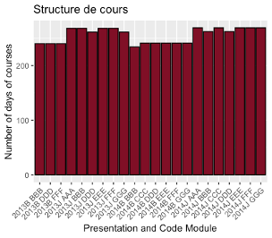

# Visualisation des données avec R

Ce projet est conçu pour fournir une introduction complète aux techniques de visualisation de données que j'ai réalisé, en se concentrant particulièrement sur des analyses visuelles plus profondes et intuitives.

## Table des matières
1. [Création de graphiques multi-variés.](#multi-variés)
2. [Visualisation des indicateurs d'éducation et d'apprentissage OULAD.](#oulad)
3. [Construction_de_Cartes](#utilisation)
4. [Visualisation des données démographiques.](#demographique)
5. [Visualisation des données économiques et sociales.](#sociales)

## Visualisation des indicateurs d'éducation et d'apprentissage OULAD.

 

